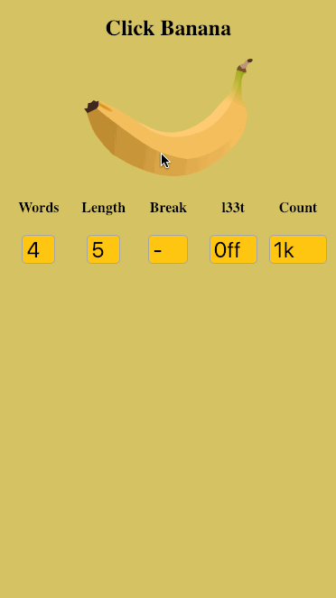

<h3 align="center">Banana Password</h3>

A simple random password generator using dictionary words from a list of the top 30,000 words in the English language.
[Passwords](https://www.theregister.co.uk/2019/02/14/password_length/) have never been so important in a world of [data breaches](https://www.theguardian.com/technology/2019/jan/17/breached-data-largest-collection-ever-seen-email-password-hacking).


 <br><a href="http://www.bananapassword.com">Website</a>

-----------------First Run------------------------

install git, install nodejs, install npm and clone repository.

in repository root directory.

      `npm install`  

installs package.json dependencies

      +

      `sudo npm install -g nodemon`  

keeps node running during changes

From repository directory.
In two terminals set to run...

      ```
      npm run build
          +
      npm run server:dev
      ```

Open browser and go to 'localhost:3000'

-----------------Thanks to:-----------------------

Banana logo from rdevries @ https://openclipart.org/detail/196028/banana

For creating CSS GRID templates @ https://www.layoutit.com/ 

Inspired by 
XKCD - https://xkcd.com/936/

Computerphile ep. 'How to Choose a Password'
https://www.youtube.com/watch?v=3NjQ9b3pgIg

<p align="center">
  
</p>
